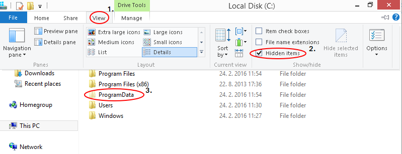
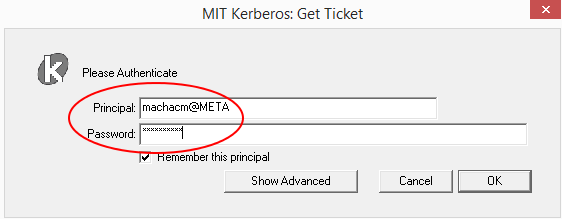
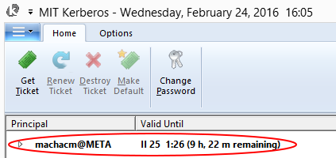

# Kerberos

[Kerberos](https://en.wikipedia.org/wiki/Kerberos_(protocol)) is a single sign-on system. Installing Kerberos on your PC means you don't have to fill in your password with every login attempt. You login only once, the Kerberos server issue a ticket which is stored in your computer. During the validity of the ticket you can log in to every frontend, compute node or storage without entering a password. 

## Linux

### Install Kerberos

On Ubuntu or other Debian-like system, you can install Kerberos using apt command.

```
# update repositories and upgrade your system (recommended)
# you will need to enter your root password to your computer (because sudo)
sudo apt update && sudo apt upgrade

# install kerberos
# package ssh-krb5 may not be necessary
sudo apt install krb5-user ssh-krb5
```

You can skip the configuration graphical wizard (click on Ok, Next, ...), the  environment can be set up later.

On Mac, Kerberos is available as part of the MacOS.

### Download the configuration file

Copy up-to-date Kerberos's config file from any frontend. For example:

    sudo scp user123@skirit.ics.muni.cz:/etc/krb5.conf /etc/

!!! note
    MacOS users: The location of the configuration file is different than the traditional Linux location. Instead of `/etc/krb5.conf`, the Kerberos configuration file is located in `/Library/Preferences/edu.mit.kerberos`, which follows more closely the naming conventions in Mac OS X.

### Configure SSH

Open the `~/.ssh/config` file in any text editor and set several GSSAPI values to `yes`:

    nano ~/.ssh/config

The  following lines have to be added to the configuration file:

```
# Kerberos access (Metacentrum)
GSSAPIAuthentication yes
GSSAPIDelegateCredentials yes
GSSAPIKeyExchange yes
```

You can also make the change of SSH client configuration in a file `/etc/ssh/ssh_config`, it affects settings of all users on your system.

### Usage

Run these commands:

```
# obtain ticket from Kerberos server
# You will be asked to fill in password
kinit user123@META 

# check valid tickets
klist
```

You should get an output similar to this one:

```
Ticket cache: FILE:/tmp/krb5cc_1000
Default principal: user123@META

Valid starting     Expires            Service principal
05/26/21 17:48:19  05/27/21 17:48:17  krbtgt/META@META
```

It means that you have valid ticket for 24 hours to META (Metacentrum).

You can get a ticket with renew ability (maximum time in Metacentrum is 7 days):

```
# You will be asked to fill in password
kinit -r 7d META_USERNAME@META
```

Now, You can log in to any node by command e.g.:

    ssh user123@skirit.ics.muni.cz


!!! tip
    If you cannot login try running command `ntpdate tik.cesnet.cz` to synchronize clock.

## Windows

!!! tip
    If you have Windows subsystem for Linux (WSL) installed, you can follow instructions for Linux.

!!! warning
    These tutorials work on Windows 8.1, other versions of Windows may need slight changes.

### Installation

**Download & install Kerberos**

Download the latest Kerberos release from the [MIT Kerberos distribution page](http://web.mit.edu/Kerberos/dist/index.html#kfw-4.0) and install it.

**Enable hidden items**

You have to enable hidden items in order to see the ProgramData folder needed in the next step. 



**Edit kr5.ini file**

Download/copy the `/etc/krb5.conf` from any frontend and save it to `C:\ProgramData\MIT\Kerberos5\krb5.ini` (you need administrative privileges to do so).

!!! tip 
    Save the file as "krb5.ini" with quotation marks to force .ini file extension

### Usage

**Open MIT Kerberos**


**Get a new ticket**


**Fill in MetaCentrum username and password**



and click OK

You should see a valid Kerberos ticket now and if you did everything right, you should not need to type in your password during login phase (e.g. when using PuTTY):


