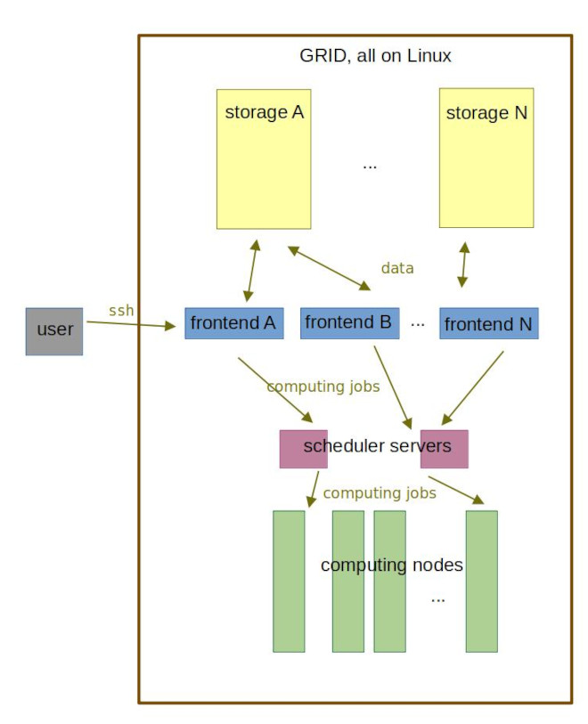
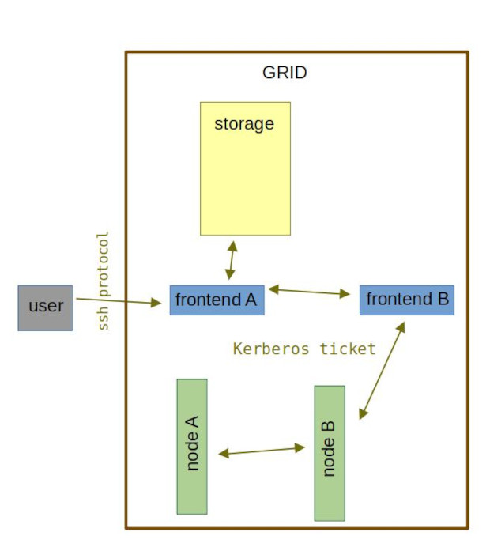

# Log in

Users connect to MetaCentrum by using `ssh` to any of the login nodes called **frontends**.



In Linux, macOS, Windows PowerShell and MobaXterm the `ssh` command can be given in the terminal.

=== "Linux, macOS, Windows PowerShell and MobaXterm terminal"

    Open the terminal and on CLI type

    ```
    ssh your_username@frontend
    ```

=== "Windows PuTTY"

    1. Open PuTTY
    2. Specify frontend name as Host name
    3. Use default port 22
    4. Use SSH connection type, protocol version 2
    5. Click on "Open"
    6. A terminal should appear prompting for your MetaCentrum username and password.
    7. On the command line type

    ```
    ssh your_username@frontend
    ```
If you log in for the first time, you will be prompted by a query similar to the following:

    The authenticity of host 'skirit.ics.muni.cz (2001:718:ff01:1:216:3eff:fe20:382)' can't be
    established. ECDSA key fingerprint is SHA256:Splg9bGTNCeVSLE0E4tB30pcLS80sWuv0ezHrH1p0xE.
    Are you sure you want to continue connecting (yes/no)?

Type "yes". The public key of the frontend will be saved to your `~/.ssh/known_hosts` file.

!!!tip 
    Strictly speaking the user should always verify a new key before adding it to a list of known hosts. For a howto on SSH key verification, see [more detailed page on SSH key verification](../../access/connect-auth/).

Once the terminal connection to a frontend is open you can start using it with the Linux command line tools (bash shell).

A complete list of frontends is given below. You can use any of them. We encourage users to pick one that is closest to their physical location (city) to minimize network lag.

!!! tip
    In case your favourite frontend is down or going just too slow, do not hesitate to use another one.   

--8<-- "frontend-table.md"

!!! warning

    The frontend nodes can be used for light pre- and postprocessing and manipulation of data. All other tasks must be submitted as jobs to the batch job system. If you need to run something interactively, submit an interactive job.

## Kerberos 

After the user enters MetaCentrum infrastructure by logging in, they will need also to be able to move between computational nodes, reach storage spaces residing on different machines etc. It would be very inconvenient to authenticate by password every time. Therefore the authentication of user **within** the MetaCentrum infrastructure is done by [Kerberos protocol](https://en.wikipedia.org/wiki/Kerberos_(protocol)).



After the user logs in, they automatically obtain a **Kerberos tickets**. As long as the ticket is valid, user can move between machines, run jobs, copy files without bothering about the authentication.

!!! warning
    The ticket is valid for 10 hours. If you stay logged in for longer, you will need to re-generate your ticket with `kinit` command.

**Basic Kerberos commands**

- `klist`  - list all current tickets
- `kdestroy` -  delete all tickets
- `kinit` - create new Kerberos ticket

It is also possible to install Kerberos on your PC. For more in-depth info, see [Kerberos advanced page](../../access/kerberos).
