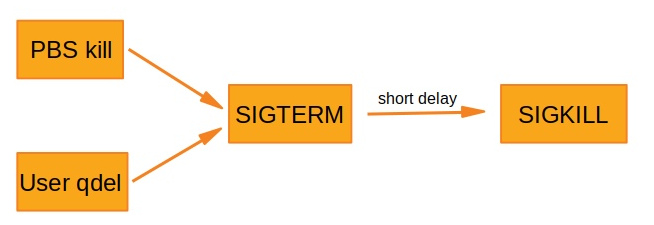

# Trap command usage

Many users add the following line to their batch script:

    trap 'clean_scratch' TERM EXIT

This `trap` command makes sure that, upon the termination or end of the calculation, a systemwide-installed script `clean_scratch` cleans scratch automatically.

!!! warning
    It is perfectly OK to use the `trap` command. There are several cases when the command may backfire, though.

## Trap the TERM

When the job is killed either by PBS or by the user (qdel command), the following happens:



The batch script receives `SIGTERM` signal. **There is no way how to distinguish whether the job was killed by PBS or by the user.** On receiving the `SIGTERM`, the running process may take a variety of actions - it may stop immediately, or it may attempt to clean up *and* stop, or it may do nothing. If the process keeps running, the `SIGTERM` signal is after several seconds followed by `SIGKILL` (equivalent to `kill -9`), which stops it immediately.

- What action is taken upon receiving a `SIGTERM` can be defined via trap command. 
- `SIGKILL` cannot be trapped, ignored nor reacted to.

```
#!/bin/bash
trap 'clean_scratch' TERM # clean the scratch if you receive SIGTERM
```

This solution is useful to get rid of mess left after user-killed jobs, but it may backfire when the job was killed by PBS, typically when walltime limits are exceeded and the `clean_scratch` removes all potentially valuable checkpoint files.

Adding

```
#!/bin/bash
# on SIGTERM, attempt to copy away potentially valuable files
trap 'cp all_checkpoint_files somewhere_safe/ ; clean_scratch' TERM  
```

can improve things, but will clutter user's home directory by unwanted files in other cases. Moreover, if the files are large and/or numerous, the copying may not finish in time before being interrupted by `SIGKILL` signal and the data need to be retrieved from scratch manually anyway.

## Trap the EXIT

EXIT is not a signal, but for the purpose of trap command it can be treated in the same way. `EXIT` happens when the script ends, either by executing the last line or via the `exit` command like in the code snippet below:

```
#!/bin/bash
test -n "$SCRATCHDIR" || { echo >&2 "Variable SCRATCHDIR is not set!"; exit 1; }
```

If the trap for `EXIT` is set

```
#!/bin/bash
trap 'clean_scratch' EXIT # if the script exits, clean scratch
```

the scratch will be cleaned if the script hits `exit` command or - at the latest - after it runs to an end.

The use of trap upon EXIT can backfire, too. Suppose the user adds the trap with the purpose to clean up after the script has run to an end, then adds some petty sanity check after the core calculation is done.

```
#!/bin/bash
...
trap 'clean_scratch' EXIT
...
./potentially_long_calculation_producing_result_files
test -n some-directory || { echo >&2 "Directory does not exist!"; exit 1; }
cp result_files somewhere/
...
```

This, too, can lead to unintentional loss of results, as the `clean_scratch` is executed before the result files are copied away. 

