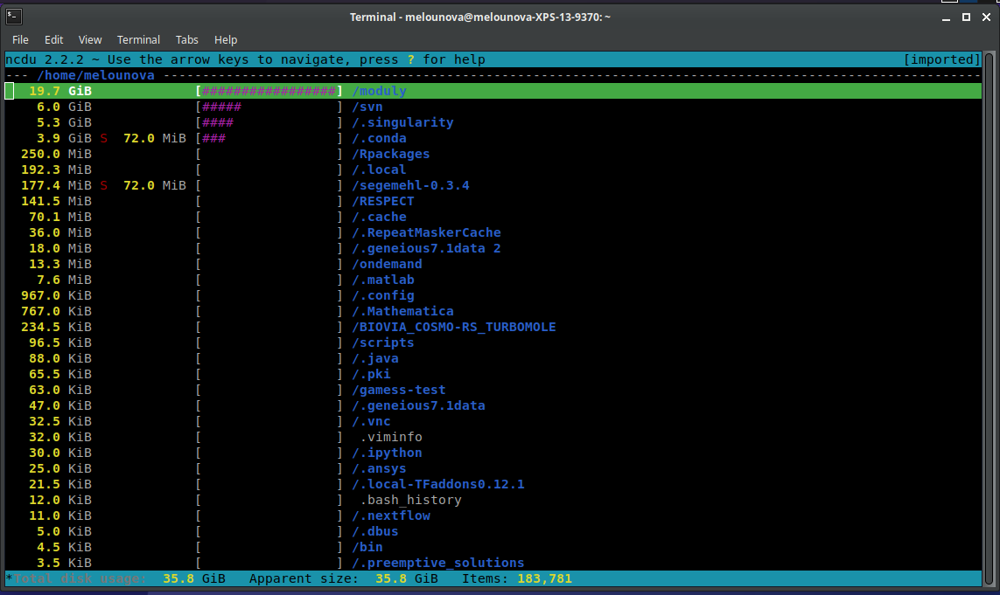
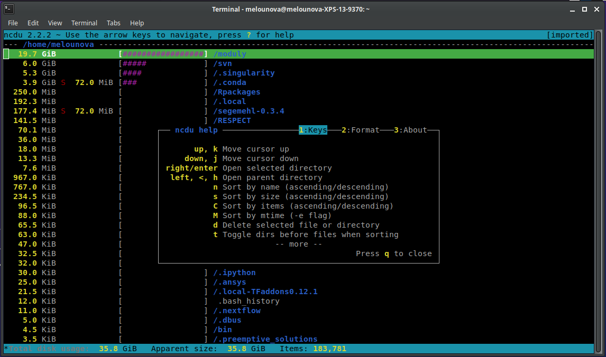
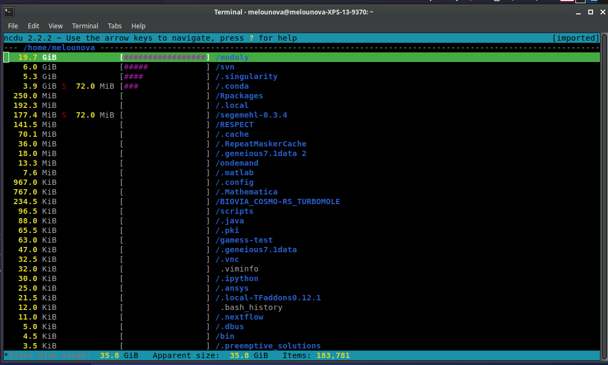
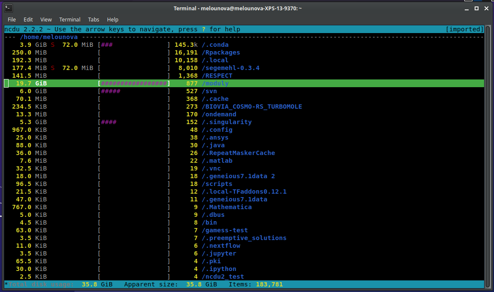

# Quotas


Keeping large data volumes or too many files in user's homes is problematic, since it significantly increases the time needed to backup the home directories as well as to manipulate them for any other purpose. For the sake of sustainability of system services, **a quota on number of files** as well as **a quota on total volume of data** is set on most storages.

You can see the state of your quotas:

- in the table that appears every time when you login on a frontend,
- at your [quota overview in PBSmon](http://metavo.metacentrum.cz/en/myaccount/kvoty).

## Find your large data

### `ncdu2` tool

`ncdu2` command is a tool especially suitable to locate which files occupy most of your quota.

`ncdu2` goes through directory structure, collects the data and soerts them according to size / or number of files. It is therefore suitable to check **both for large files** as well as for **directories with huge number of (possibly small) files**.

`ncdu2` is installed on all MetaCentrum nodes.

#### Get the database 

**Basic usage**

The `ncdu2` tool collects the info in a `.json` file. For example, command

    ncdu2 -x -o output.json /storage/cityXY/home/user_123/

will create an `output.json` file with information about the content of home directory at sstorage `cityXY` for user `user_123`.

**Probe from storage, not from a frontend**

Since probing the directory structure of `/storage` is uneffective when done from a frontend, it is faster to run `ncdu2` directly on `/storage` where the directory of interest is located:

    ssh storage-cityXY.metacentrum.cz 'ncdu2 -x -o output.json /storage/cityXY/home/user_123/'

**If the `.json` file is large, gzip it up**

If youo suspect the resulting `.json` file will be a large one (typical for number-of-files quota overflow), you can consider compressing it by `gzip`:

     ssh storage-cityXY.metacentrum.cz 'ncdu2 -x -o output.json /storage/cityXY/home/user_123/' | gzip > output.json.gz

**Wrap it in a job**

If it seems that the process will take longer, you should wrapt the command to a batch job, e.g.:

```
#!/bin/bash
#PBS -N ncdu_test
#PBS -l select=1:ncpus=1:mem=4gb:scratch_local=10gb
#PBS -l walltime=2:00:00 

RESDIR="/storage/brno2/home/user123/ncdu2_result"

cd $SCRATCHDIR

ssh storage-brno2.metacentrum.cz 'ncdu2 -x -o files_brno2.json ~/' | gzip > files_brno2.json.gz

cp files_brno2.json.gz $RESDIR/

clean_scratch

``` 

#### Display the database

Onde you have the result file, you can open the `ncdu2` pseudo-graphical interface as:

    zcat ncdu2.json.gz | ncdu2 -f -   # for .gz file
    ncdu2 -f files_brno2.json

You will see something like the following. 



By pressing `?` the help will be displayed.



### List by size

If you need to locate where most of the volume resides, press `s`.



### List by number of files

If you need to locate directories with large number of files, press `c`, then `C`.



## When you exceed a quota 

### Delete it

If you produce **large** amount of data by mistake, remove it either within a single command, e.g.

    (BUSTER)user123@tarkil:~$ ssh user123@storage-brno6.metacentrum.cz rm -rf ~/junk_dir

or wrap the command into a batch job to avoid waiting for the command to end:

    (BUSTER)user123@tarkil:~$ qsub -l walltime=24:00:00 remove_junk_dir.sh

### Pack small files into large chunks

If the data is not junk, pack them them into larger chunks using the `tar` command either from a command line or from within a batch job:

    (BUSTER)user123@tarkil:~$ ssh usr123@storage-brno6.metacentrum.cz tar -cf not_junk_dir.tar ~/not_junk_dir
    (BUSTER)user123@tarkil:~$ qsub -l walltime=24:00:00 tar_my_files.sh

If you have enough space on your storage directories, you can keep the packed data there. However we encourage users to [archive](#data-archiving) any finished-project data of permanent value.

If you for some reason need to shift some of your quotas, [contact us](/contact).

### Archive the data

Due both to operational reasons (regular backups of storages) and for safety reasons (storages have weaker backup policy than archives), users should [archive](#data-archiving) any data that are of permanent value to them and may be needed in future.

Archiving data from finished projects also helps to avoid problems with storage quotas.

### Move the data to another storage

This is an intermediate solution. The storages quotas are separate, so you can temporarily dump some data to different storage where you have more free space.

## Root filesystem quota

### What is root filesystem quota

Apart of quota set on storage, there is a **separate quota for user's data outside the home directory**.

This applies to situations when **one of user's processes writes to /tmp directory** and (on computational node) when **the user's job produces large standard output (.OU) or error (.ER) files in /var/spool directory**.


!!! warning "Root filesystem quota is only 1 GB"
    The root filesystem quota is relatively small. If it is exceeded, an email is sent to the user with instructions what to do. Until the data are deleted, no further calculations will be run on the computational node.

### How to clear files filling the quota

1. Login onto the affected machine.

    `ssh user123@halmir18.metacentrum.cz`

2. List the files in your filesystem quota using the `check-local-quota` tool.

    `check-local-quota`

3. Inspect the files; if they contain valuable data, copy them to your home directory. After that remove them.
4. Check local quota again; there should be no files left.

### How to prevent the situation

**Redirect TMPDIR to SCRATCHDIR**

A common variable name for a directory where temporary files shall be kept is `TMPDIR`.

Some software uses a `/tmp` directory as a default for temporary files. Try adding 

    export TMPDIR=$SCRATCHDIR

to the beginning of your batch script. This will force the application to place the temporary files into scratch directory instead.

**Dump/redirect large outputs**

If the problem was caused by large `.OU` or `.ER` files, either redirect them to `/dev/null` directory

    ./your_application ... > /dev/null # redirect .OU to /dev/null
    ./your_application ... 2> /dev/null # redirect .ER to /dev/null
    ./your_application ... > /dev/null 2>&1 # redirect both .OU and .ER to /dev/null

or redirect them to a file in your scratch directory

    ./your_application ... > standard_output.txt # redirect .OU to standard_output.txt
    ./your_application ... 2> error_output.txt # redirect .ER to error_output.txt
    ./your_application ... > std_err_output.txt 2>&1 # redirect both .OU and .ER to std_err_output.txt

If you redirect to `/dev/null`, the data will be dumped and there is no way to get them back later. The second way will make possible to inspect the files after your calculation is done.

The above mentioned causes are the most common ones. Your filesystem quota can be exceeded also in other ways. If you are not sure what caused the problem and how to prevent the situation to happen again, feel free to [contact us](/contact).


