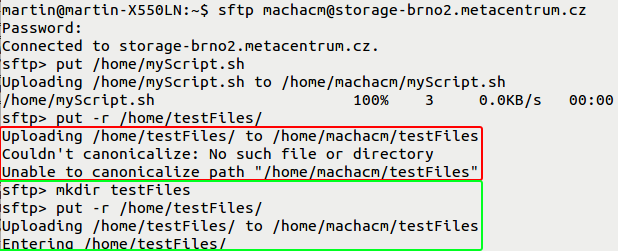

# Useful commands 

## `scp`

scp works in pretty much the same way as normal `cp`, only it allows you to copy files between different machines.

    user123@home_PC:~$ scp -r my_dir user123@skirit.metacentrum.cz: # copy directory "my_dir" from user's PC to a home directory on skirit
    user123@home_PC:~$ scp -r user123@skirit.metacentrum.cz:~/results . # from user123's home on skirit, copy to user123's PC folder "results" 

## `wget`

Alternative way to download data is a `wget` command. `wget` will work only if the **file is available via ftp or http(s) protocols**, typically when it is a downloadable file on some server. `wget` is faster and less safe than `scp`, so it may be a method of choice if you need to download larger amount of data from a server where privacy is not an issue.

    ssh user123@skirit.metacentrum.cz # login to a frontend
    user123@skirit.metacentrum.cz:~$ mkdir data && cd data 
    user123@skirit.metacentrum.cz:~/data$ wget https://www.someServer.org/someData.zip # download file someData.zip from server https://www.someServer.org

Using `wget` you can only transfer data **to** Metacentrum machines.

`wget` is of no use if you want to transfer **from** Metacentrum.

## `sftp`

sftp is just another protocol for data transfer. Contrary to `scp` it is **interactive** and apart from copying it also enables the user to manipulate files and directories on the remote side. We recommend to use `scp` if you need only to copy the data.

!!! warning "Windows users alert"
    Windows users need an SFTP client, we recommend the WinSCP application. Keep in mind you have to fill in as target chosen NFS4 server instead of frontend in Step 1. Make sure you have selected SFTP file protocol, too.

1.    `sftp user123@target_NFS4_server` # Login
2.    `help` List available commands
3.    `get target_file` Download target file to your local system
4.    `get -r target_directory` Download target directory to your local system
5.    `put target_file` Upload target file to server
6.    `put -r target_directory` Upload target directory to server

!!! bug
    There is a bug affecting Ubuntu 14.04+ concerning the recursive copy command. If `put -r` fails, create the target directory on the server first to work around this issue.

## `rsync`

The `rsync` command is a more advanced and versatile copying tool. It enables the user to synchronize the content of two directories in a more efficient way than scp, because `rsync` copies only the differences between the directories. Therefore it is often used as a tool for regular backups.

**Examples**

Copy directory data to archive:

    $ rsync -zvh /storage/brno2/home/user123/data /storage/du-cesnet/home/user123/VO_metacentrum-tape_tape

Copy only the content of directory data to archive:

    $ rsync -zvh /storage/brno2/home/user123/data/ /storage/du-cesnet/home/user123/VO_metacentrum-tape_tape

## `tar`

`tar` (tape archiver) command enables to pack files and directories into one archive file. `tar` by itself does not compress the size of the files, and the resulting volume of the packed archive is roughly the same as the sum of the volumes of individual files.

`tar` is often used together with commands for file compression like `gzip`.

**Examples**

In `/storage/du-cesnet/home/USER/VO_metacentrum-tape_tape-archive`, create uncompressed archive of the directory `~/my-archive`:

    tar cvf /storage/du-cesnet/home/USER/VO_metacentrum-tape_tape-archive/my-archive.tgz ~/my-archive

In `/storage/du-cesnet/home/USER/VO_metacentrum-tape_tape-archive`, create archive of the directory `~/my-archive` and compress it by `gzip` command:

    tar czvf /storage/du-cesnet/home/USER/VO_metacentrum-tape_tape-archive/my-archive.tgz ~/my-archive

List the content of the existing archive:

    tar tzf /storage/du-cesnet/home/USER/VO_metacentrum-tape_tape-archive/my-archive.tgz

Unpack the *whole* archive `my-archive.tgz` residing in `storage/du-cesnet/home/USER/VO_metacentrum-tape_tape-archive/` into current directory:

    tar xzvf /storage/du-cesnet/home/USER/VO_metacentrum-tape_tape-archive/my-archive.tgz

Unpack *part* of the archive:

    tar tzf /storage/du-cesnet/home/USER/VO_metacentrum-tape_tape-archive/my-archive.tgz # list the content of the archive
    # unpack only file PATH1/file1 and directory PATH2/dir2 into the current directory
    tar xzvf /storage/du-cesnet/home/USER/VO_metacentrum-tape_tape-archive/my-archive.tgz "PATH1/file1" "PATH2/dir2"

There are many other options to customize the tar command. For the full description, read manual pages (`man tar`). 

