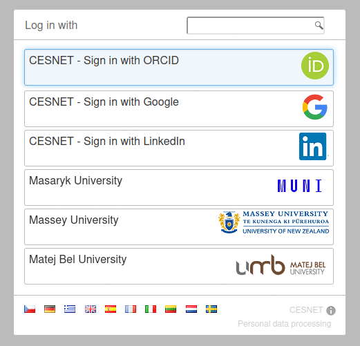
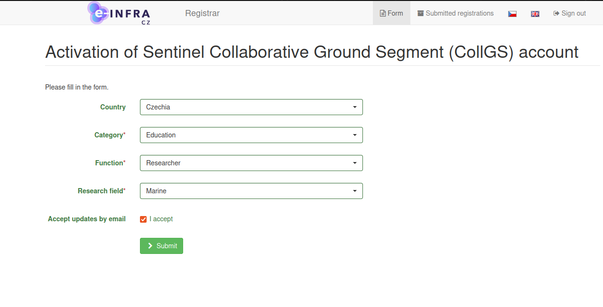
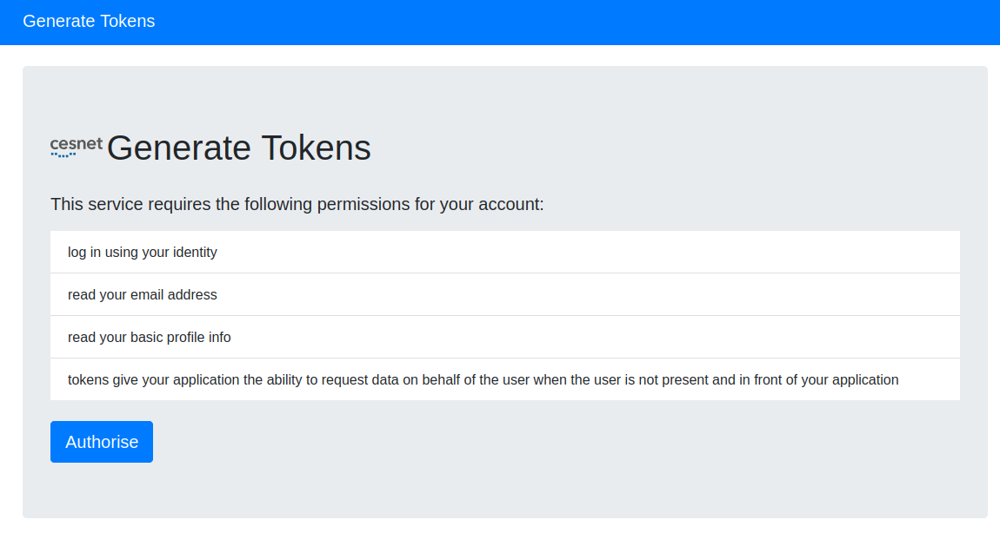
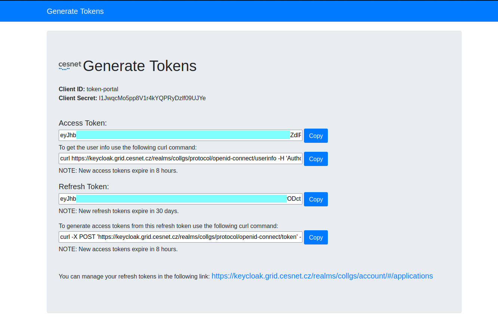
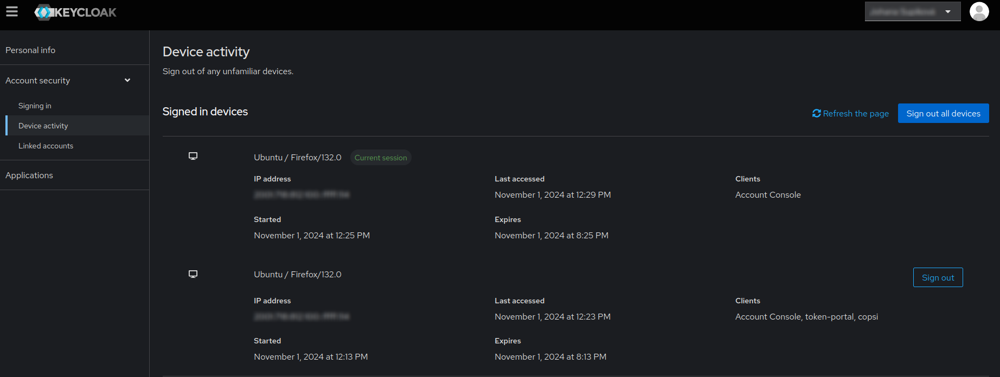

## User Authentication in GSS

This section describes user authentication in the GSS (Gael Store Service) system, including both interactive login via the graphical COPSI component and obtaining and exchanging tokens for machine use. 

Both methods require registration.

Instructions on using this software can be found in the section on [working with Sentinel satellite data](./sentinel.md).

## Graphical Interface


When accessing the COPSI application at [https://collgs.cesnet.cz](https://collgs.cesnet.cz), a login window will appear.

After confirming by clicking _Sign In_, you will be redirected to select the community you want to log in with.


If you do not have an account in any of the communities, choose the option _E-INFRA CZ_. Then select your affiliated institution or choose a social identity (e.g., ORCID).



Complete the login process. If this is your first login, you will be redirected to a registration form.

Fill in the required details in the form. By submitting the completed application, an account is created in the IAM Perun system.

The account remains active for two years, and you will receive an email notification before the account expires to extend its validity.



Based on the selected community during login, you will either be redirected back to the COPSI application, or your application will wait for approval by the organization administrator.  

If, after approval, the application redirects you to a page informing you that you are already registered, try accessing the application in an incognito window or clearing your cookies.

## Machine Access

To download products via the OData API, authentication using an access token must be added to the requests.

Tokens can be obtained at [https://keycloak.grid.cesnet.cz/token-portal](https://keycloak.grid.cesnet.cz/token-portal).



On the portal page, proceed by selecting _Authorise_. If you are generating tokens for the first time, you will need to register.

Otherwise, log in similarly to the process described in [Graphical Interface](#graphical-interface).



On the _Generate Tokens_ page, the following items are available:

**Access Token** - Used for authentication and authorization when accessing the API. It is valid for 8 hours.

**Refresh Token** - Used to renew the access token without the need to log in again. It is valid for 30 days. Each time an access token is exchanged, a new refresh token is issued, and the previous one becomes invalid. For the next token exchange, the new refresh token must be used. The new refresh token will also have a validity of 30 days.

**Client ID and Client Secret** - Used to authenticate the application during token exchange.

**Token Exchange Command** - This command allows you to obtain a new access token and refresh token with full validity when the access token expires.

**Token Management Link** - Provides access to the application for managing your account and tokens. Here, you can log out from a device and revoke the refresh token.

### How to Work with Tokens

#### 1. Accessing the API with an Access Token

After obtaining an access token, include it in your API requests as an authorization header:

    Authorization: Bearer <access_token>

Adding this header to your requests allows the API to verify your identity and grant the necessary permissions.

A GSS OData API call may look as follows:

```shell
curl -X GET "https://collgs.cesnet.cz/odata/v1/Products?\$filter=startswith(Name,'S1')%20and%20contains(Name,'SLC')" \
-H "Authorization: Bearer $ACCESS_TOKEN"  \
-H "Accept: application/json"
```

#### 2. Refreshing the Access Token Using the Refresh Token

When the access token expires, you can use the refresh token to obtain a new access token without logging in again.

The process involves sending a POST request, which is pre-configured as a _curl_ command on the Token Portal page.  If you are using Python version 3, you may need to replace _python_ with _python3_ in the command.  

This request will return a new access token with an 8-hour validity, along with a refresh token valid for 30 days.

The response in JSON format will look as follows:

    {
    "access_token": "eyJh....gywQ",
    "expires_in": 300,
    "refresh_expires_in": 28800,
    "refresh_token": "eyJh....xjVg",
    "token_type": "Bearer",
    "id_token": "eyJh....zLMA",
    "not-before-policy": 0,
    "session_state": "80....ff",
    "scope": "openid email profile"
    }

You can use the new access token for further requests in GSS, and replace the old refresh token with the new one.

#### 3. Secure Token Storage

**Access Token**:  
Store in memory (e.g., a variable or cache) only while it is active. Since it has a shorter validity period, there is no need for long-term storage.  

**Refresh Token**:  
It is recommended to store in a secure location, such as a database or encrypted storage.

Since the refresh token has a longer validity period, it should be stored securely with limited access.  

#### 4. Token Revocation

If necessary, tokens can be revoked using the account management application linked at the bottom of the Token Portal.

Revocation (logging out) is located under **Account Security > Device Activity**.

Use the _Sign out_ option to log out a specific device, or _Sign out all devices_ for a complete logout.  



### Token Exchange

If you are already working with tokens from EGI Check-in, it is possible to exchange them for tokens granting access to the GSS system without further login. In this case, send a valid access token issued by EGI Check-in via POST method to the endpoint [https://keycloak.grid.cesnet.cz/realms/collgs/protocol/openid-connect/token](https://keycloak.grid.cesnet.cz/realms/collgs/protocol/openid-connect/token) and attach the following to the request body:

    {
    "client_id": "token-exchange",
    "grant_type": "urn:ietf:params:oauth:grant-type:token-exchange",
    "subject_token": {EGI access token},
    "subject_issuer": "https://aai.egi.eu/auth/realms/egi"
    }

In the response, you will receive an access token that can be used for GSS API calls.
