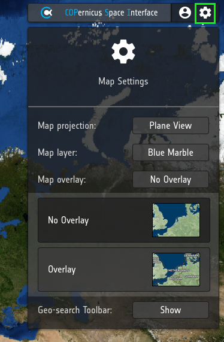
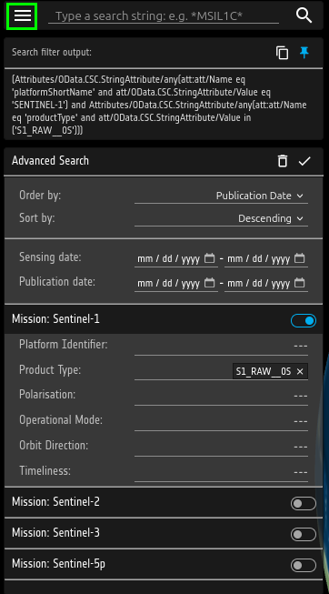

# Access to Data

The National Node allows access to Sentinel mission data by all common means. Currently, there are no speed or capacity limitations applied to it.

The previous version of the software providing access to Sentinel satellite data, Sentinel DataHub System, which is still available at [https://dhr1.cesnet.cz](https://dhr1.cesnet.cz/), is being replaced by the new GSS (Gael Store Service) software.

In the first half of 2025, both systems will be accessible simultaneously, after which GSS will fully replace it.

One of the changes related to the transition to the new system is, for example, the removal of the ability to log into the graphical interface using a username and password or the introduction of tokens for API communication for machine access.

## Graphical User Interface

The graphical user interface is accessible through the COPSI (COPernicus Space Interface) application, available at [https://collgs.cesnet.cz/](https://collgs.cesnet.cz/).

Registration is required before first use, even if you were previously registered in the earlier version of the system (Sentinel DataHub System).

A detailed guide for registration and login can be found in the [User Authentication in GSS](./gss_login/) section.

A detailed description of COPSI is available in the Serco's [user manual](https://collgs.esa.int/wp-content/uploads/2024/06/ALIA-COPSI-SUM-22-0001-COPSI-Software-User-Manual_3.0.0.pdf).


You can change the map projection, display of geographic names, and terrain settings in the settings menu in the top right corner.



### Search and Filtering

#### **Basic Search**

The search bar, located in the top left corner of the page, allows you to enter simple text queries. It also offers an advanced search option with various filters available in a dedicated section.

The catalog is based on the OData protocol and does not support full-text search. Therefore, users must enter a filter using the correct OData `$filter` syntax. However, users can add a wildcard `*` to the text string as a simplified form of a query by product name:

`<Text>*` will be replaced in the request with `startswith(Name, '<Text>')`, meaning the product name **must start** with the string.

`*<Text>*` will be replaced with `contains(Name, '<Text>')` - the product **must contain** the string.

`<Text>*` will be replaced with `_endswith(Name, '<Text>')` - the product **must end** with the string.

This way, the asterisk can be used for more flexible product name searches. For example, adding the text `*S3B_OL*` to the search bar will trigger the query
`odata/v1/Products?$filter=contains(Name, 'S3B_OL')`.

#### Advanced Search

The advanced search section can be displayed by clicking on the icon to the left of the search bar. 

Once the product list is loaded, it will appear below the search bar. 

Products can be filtered by mission, acquisition date, etc. 

The resulting filter used for the query is displayed below the search bar, from where it can be copied for potential machine processing.




#### Geographical Search

The geographical search panel is located on the screen in the middle right.

With its help, geographical searches can be performed based on polygonal areas, which are drawn directly onto the map.

The same functions of this panel are also available in the context menu, which can be opened by right-clicking anywhere on the map.


### Product Viewing

The search results are displayed below the search bar.


Each product in the list is displayed in a frame, with the product name shown at the top in the header.

On the left side of the frame, you will find the main information about the product, such as the platform name, capture date, and file size.

On the right side is a preview of the product image, if available. Below the preview is an area with action buttons for copying the URL and downloading the product.

When hovering the mouse over the contours on the map, all contours that the mouse cursor is over are highlighted, and the corresponding products in the list are also highlighted.

When hovering the mouse over a product frame in the search results, the corresponding contour on the map is highlighted.

## Machine Access

The national node CollGS supports machine access via the *OData* protocol. Machine access is suitable for automated tools and for batch downloading larger amounts of data.

The query interface is accessible at: [https://collgs.cesnet.cz/odata/v1](https://collgs.cesnet.cz/odata/v1).

For writing simple scripts, tools like `curl` or `wget` are most useful. Authentication for downloading products can no longer be done using a username and password, but it is necessary to use OIDC tokens, which are generated at the token portal address: [https://keycloak.grid.cesnet.cz/token-portal](https://keycloak.grid.cesnet.cz/token-portal).

A more detailed description of authentication can be found in the guide [User Authentication in GSS](./gss_login/).
### Product Search

The following examples summarize how to construct the URL for searching products in the OData API.

A detailed guide is available in the document [GSS Administration Manual](https://collgs.esa.int/wp-content/uploads/2024/07/GAEL-P311-GSS%20-%20Collaborative%20Data%20Hub%20Software%20GSS%20Administration%20Manual_1.6.5.pdf#page=77) - Chapter 10.

An alternative is using the [STAC metadata catalog](#stac-metadata-catalog).

When using the curl tool, special characters in the URL, such as spaces and quotes, must be properly encoded.

The following commands summarize the basic use of the OData API with the access token stored in the `ACCESS_TOKEN` variable.

To list all products:

```shell
curl "https://collgs.cesnet.cz/odata/v1/Products" \
-H "Authorization: Bearer $ACCESS_TOKEN"
```

To list products by UUID (e.g. *4125df3d-468c-4c3f-b283-249874447a18*):

```shell
curl "https://collgs.cesnet.cz/odata/v1/Products(4125df3d-468c-4c3f-b283-249874447a18)" \
-H "Authorization: Bearer $ACCESS_TOKEN"
```

Examples of Filtering and Encoding Special Characters in _curl_:

|                                         | Filter                                                                                                                                              | CURL Command                                                                                                                                                                                                                                                                   |
|-----------------------------------------|-----------------------------------------------------------------------------------------------------------------------------------------------------|--------------------------------------------------------------------------------------------------------------------------------------------------------------------------------------------------------------------------------------------------------------------------------|
| Search by mission (e.g., `SENTINEL-1`)  | `$filter=(Attributes/OData.CSC.StringAttribute/any(att:att/Name eq 'platformShortName' and att/OData.CSC.StringAttribute/Value eq 'SENTINEL-1'))`  | `curl 'https://collgs.cesnet.cz/odata/v1/Products?$filter=(Attributes%2FOData.CSC.StringAttribute%2Fany(att%3Aatt%2FName%20eq%20%27platformShortName%27%20and%20att%2FOData.CSC.StringAttribute%2FValue%20eq%20%27SENTINEL-1%27))' -H "Authorization: Bearer $ACCESS_TOKEN"` |
| Search by publication date (e.g., from `15.3.2024` to `16.3.2024`) | `$filter=(PublicationDate ge 2024-03-15T00:00:00.000Z and PublicationDate le 2024-03-16T23:59:59.999Z)` | `curl "https://collgs.cesnet.cz/odata/v1/Products?$filter=(PublicationDate%20ge%202024-03-15T00:00:00.000Z%20and%20PublicationDate%20le%202024-03-16T23:59:59.999Z)" -H "Authorization: Bearer $ACCESS_TOKEN"`                                                               |
| Search by part of the name (e.g., starts with `S1` and contains `SLC`) | `$filter=startswith(Name,’S1’)  and contains(Name,’SLC’)`  | `curl 'https://collgs.cesnet.cz/odata/v1/Products?$filter=startswith(Name,%20%27S1%27)%20and%20contains(Name,%20%27SLC%27)' -H "Authorization: Bearer $ACCESS_TOKEN"`                                                                                                                                                                   |

### Downloading a Product

To download the entire product:

    curl "https://collgs.cesnet.cz/odata/v1/Products(4125df3d-468c-4c3f-b283-249874447a18)/\$value"  \
    -H "Authorization: Bearer $ACCESS_TOKEN"  \
    -o product_odata.zip

To download only a part (e.g., the manifest), it is best to download the specific file, like this:

    curl -v $'https://collgs.cesnet.cz/odata/v1/Products(4125df3d-468c-4c3f-b283-249874447a18)/Nodes(\'S3A_OL_1_EFR____20241008T122148_20241008T122448_20241009T125258_0179_117_380_1800_PS1_O_NT_004.SEN3\')/Nodes(\'xfdumanifest.xml\')/$value'  \
    -H "Authorization: Bearer $ACCESS_TOKEN"  \
    -o xfdumanifest.xml

## STAC Metadata Catalog

To obtain product metadata in STAC format, the catalog is available at [https://stac.cesnet.cz](https://stac.cesnet.cz). 
You can find the catalog documentation in the [STAC section](./stac.md).

## Support for Specific Applications

If you have specific requirements or need assistance in designing the optimal method for data access, please contact us at <collgs@cesnet.cz>.

For specific purposes, we can arrange:

- assistance with designing an access mechanism.
- automatic copying of new data to the user's endpoint according to the set criteria, e.g., using the SCP protocol.
- integration with your own application.

## ArcGIS Interface

Sentinel 2 imagery can also be accessed interactively through the web interface of the [ArcGIS software package](https://arcgis.cesnet.cz/apps/wabis/): 


## Contact

For inquiries or to report any issues, please contact <collgs@cesnetcz>.

System outages or planned downtimes will be announced on the [Meta VO outage page](https://metavo.metacentrum.cz/cs/news/outages.jsp).
