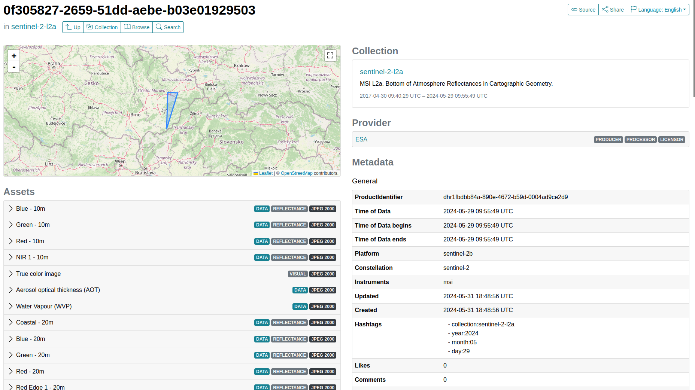
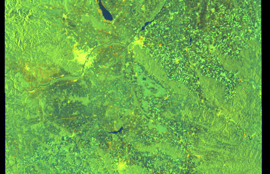

# STAC katalog
Tato dokumentace popisuje STAC katalog (SpatioTemporal Asset Catalog) vytvořený pro organizaci a správu metadat produktů
dálkového průzkumu Země. Katalog zahrnuje data z programů [Sentinel](./sentinel.md), [Landsat](./landsat.md) a [ERA5](./era5.md),
která jsou rozřazena do kolekcí.
Relevantní popisy použití STAC katalogu naleznete také na stránkách těchto programů v této dokumentaci.
Katalog je přístupný na adrese [https://stac.cesnet.cz/](https://stac.cesnet.cz/).

## Struktura katalogu
Podrobná specifikace STAC katalogu je dostupná v angličtině na [https://stacspec.org/en/about/stac-spec/](https://stacspec.org/en/about/stac-spec/). 

**Katalog** - STAC katalog je způsob, jak uspořádat a propojit data, aby se dala snadno procházet a vyhledávat. 
Funguje jako seznam, který obsahuje data a odkazy na další (pod)katalogy.

**Kolekce** - STAC kolekce poskytuje dodatečné informace o souboru dat (např. část dat Sentinelu 1 - kolekce sentinel-1-slc).
Rozšiřuje funkčnost katalogu přidáním dalších polí, která umožňují popis prostorového a časového rozsahu dat,
licence, klíčových slov, poskytovatelů, apod. Seznam kolekcí je přístupný na endpointu [/collections](https://stac.vm.cesnet.cz/collections).

**Item** - STAC item je ucelený záznam obsahující data a metadata, jehož specifikace může obsahovat časovou značku, náhledový obrázek,
odkazy k datům, odkazy k relevantním itemům a asset linky.

**Asset** - soubor přidružený ke konkrétnímu itemu. Asset je možné stáhnout, např.
náhledový obrázek, GeoTIFF nebo NetCDF soubor. Součástí metadat assetu jsou informace jako název, popis, typ a odkaz na soubor (_href_).

## API
Pro volání API použijte identickou adresu [https://stac.cesnet.cz/](https://stac.cesnet.cz/).
Podrobná dokumentace metod je k dispozici v angličtině zde: [https://stac.cesnet.cz/api.html](https://stac.cesnet.cz/api.html).
Pro prohledávání není potřeba autentizace.

K vyhledání produktů slouží endpoint [/search](https://stac.cesnet.cz/search).
Na tento endpoint v těle requestu zasíláte JSON obsahující ohraničující body (_bbox_) a časové rozmezí.

```
{
  "bbox": [5.5, 46, 8, 47.4], 
  "time": "2024-02-12T00:00:00Z/2024-03-12T100:00:00Z"
}
```

Odpověď získáte v následujícím formátu:

```
{
    "type": "FeatureCollection",
    "numberMatched": 330000,
    "numberReturned": 20,
    "features": [...],
    "links": [
        {
            "rel": "next",
            "type": "application/geo+json",
            "href": "https://stac.vm.cesnet.cz/search?&next=227165117419782344"
        },
        ...
    ]
}
```
kde **features** obsahuje itemy splňující vyhledávací parametry, **numberMatched** obsahuje celkový počet itemů splňujících
vyhledávací parametry, **numberReturned** počet aktuálně vrácených itemů a **href** zanořený v **links** je URL odkazující na další
stránku výsledků tohoto vyhledávání.


## Prohlížeč
Rovněž je k dispozici prohlížeč produktů v grafickém rozhraní: [https://stac.cesnet.cz/browser/](https://stac.cesnet.cz/browser/).

I zde jsou data rozřazena do kolekcí a je možné stáhnout jednotlivé assety.

## PySTAC a další knihovny Pythonu pro práci s geoprostorovými daty
Python poskytuje knihovnu [PySTAC](https://pystac.readthedocs.io/en/stable/), která umožňuje práci se STAC katalogem.
Při jejím použití je nutné použít API adresu [https://stac.vm.cesnet.cz/](https://stac.vm.cesnet.cz/).

```python
from pystac_client import Client
api_url = "https://stac.vm.cesnet.cz/"
client = Client.open(api_url)
```

Příklad práce s kolekcí
```python
collections = client.get_collections()
s1_collection = client.get_collection("sentinel-1-grd")
print(s1_collection.description)
```

Knihovna [Leafmap](https://leafmap.org/) slouží v prostředí Jupyter notebooků pro geoprostorovou analýzu
a umožňuje získání souřadnic, které dále využijeme po práci s knihovnou PySTAC. Pokud již známe souřadnice,
využijeme filtr `intersects` (protínání bodu), nebo `bbox` (ohraničená oblast). Následující příklady jsou
inspirovány [existujícím návodem v angličtině](https://carpentries-incubator.github.io/geospatial-python/instructor/05-access-data.html#search-a-stac-catalog).

```python
from shapely.geometry import Point
point = Point(16.6068, 49.1951)  # souřadnice Brna
search = client.search(
    collections=[s1_collection],
    intersects=point,
    max_items=10,  # omezení na počet výsledků
    method="GET"  # výchozí metoda vyžaduje autentizaci, je nutné explicitně specifikovat GET
)
print(search.matched())
```

Výsledek zobrazí, kolik itemů odpovídá zadání - příslušnost ke kolekci sentinel-1-grd a protínání Brna.

```python
for item in (search.item_collection()):
    print(item.properties)
```

Výsledek vyhledávání můžeme dále iterovat a zjistit podrobnosti o každém z 10 vrácených itemů. Výsledná
metadata mají podobný formát:

```json
{
    "productIdentifier": "dhr1006adbc3-5f9d-4273-8d00-1bdf8b435603",
    "datetime": "2024-05-26T16:43:30.929639Z",
    "start_datetime": "2024-05-26T16:43:18.430587Z",
    "end_datetime": "2024-05-26T16:43:43.428690Z",
    "sar:frequency_band": "C",
    "sar:center_frequency": 5.405,
    "sar:observation_direction": "right",
    "sar:instrument_mode": "IW",
    "sar:polarizations": [
        "VV",
        "VH"
    ],
    "sar:product_type": "GRD",
    "proj:bbox": [
        14.998892,
        47.573769,
        18.942654,
        49.47876
    ],
    "platform": "sentinel-1a",
    "s1:product_identifier": "S1A_IW_GRDH_1SDV_20240526T164318_20240526T164343_054045_069226_1020",
    ...
}
```

Pro přístup k odkazům ke stažení konkrétních snímků musíme přistoupit k assetům, které můžeme vylistovat.
```python
assets = items[0].assets
print(assets.keys())
```

V nich pak můžeme vybírat odkazy na např. náhledový obrázek, který získáme z daného linku:
```python
import requests
from matplotlib import pyplot as plt
from PIL import Image
import io

thumbnail = assets["thumbnail"].href
img_data = requests.get(thumbnail).content

plt.figure(figsize=(10, 10))
plt.imshow(Image.open(io.BytesIO(img_data)))
plt.show()
```


