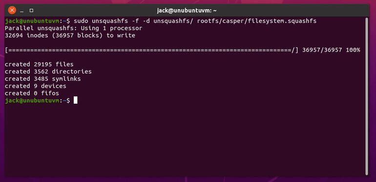
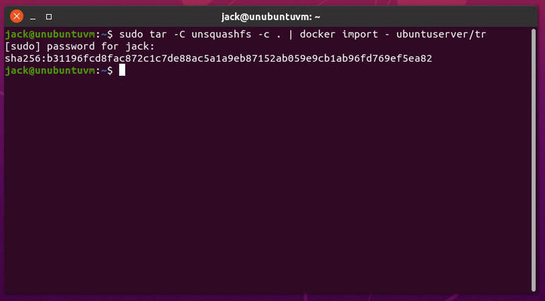
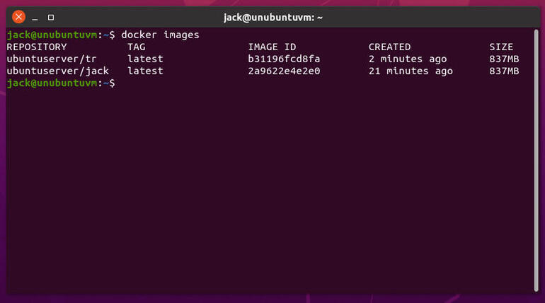

# Creating Docker Image from .iso File

Docker images of various operating system are already available on the [docker hub](https://hub.docker.com/). However, these images are usually stripped off of everything but the core (the average size is only tens of MBs), so you might find yourself searching for and installing tons of basic packages before you can properly use the image as a full-fledged operating system like the one you are using right now. And also not all operating systems already have proper docker images prepared.

This manual shows how to make a docker image from an ubuntu .iso installation file, but any linux distribution should work the same.

## How to install the necessary tools

First, you need to install `squash-fs`. To do this, open a terminal window and issue the command

    sudo apt-get install squashfs-tools -y

You might find the `squashfs-tools` is already installed. If so, move on to the next installation step.

To install Docker on your machine, go back to the terminal

    sudo apt-get install docker.io -y

Once Docker is installed, start and enable the service

```
sudo systemctl start docker
sudo systemctl enable docker
```

Add your user to the Docker group

    sudo usermod -aG docker $USER

Make the system aware of the new group

    newgrp docker

## How to mount the ISO

Now we need to mount the ISO you downloaded (or created yourself). I'll demonstrate with the Ubuntu Server 20.04.1 ISO, but make sure to download the latest stable version in the future.

    wget -P ~/Downloads/ https://releases.ubuntu.com/20.04.1/ubuntu-20.04.1-live-server-amd64.iso

Before you mount the ISO, create two new folders

    mkdir rootfs unsquashfs

To mount the ISO image into the rootfs folder

    sudo mount -o loop ~/Downloads/ubuntu-20.04.1-live-server-amd64.iso ~/rootfs

The above command will mount the image as read-only, so you can ignore the warning.

We need to locate the directory housing of the filesystem.squashfs file. To do that, change into the rootfs directory

    cd ~/rootfs

Locate the file

    find . -type f | grep filesystem.squashfs

On the Ubuntu server ISO, that file should be located in the casper directory.

Now that we know where the filesystem.squashfs file is, we can extract the necessary filesystem files from the rootfs directory into the unsquashfs directory

```
cd ~/
sudo unsquashfs -f -d unsquashfs/ rootfs/casper/filesystem.squashfs
```

Remember to replace casper with the directory housing your ISO filesystem.squashfs file.

Depending on the speed of your machine, the above command should happen pretty quickly and will end with a report of how many files, directories, symlinks, devices, and fifos were created.



## How to compress and import the image

Finally, we can compress and import the image using Docker.

    sudo tar -C unsquashfs -c . | docker import - IMAGENAME/TAG

Where IMAGENAME is the name you want to give the image and TAG is a tag for the image. When the process completes, you'll see an sha256 hash for the image printed out. 



To see your Docker image listed:

    docker images

Your newly crafted image should appear 



And that's all there is to creating your own Docker images from downloaded ISOs. Congratulations, you're one step closer to ensuring your containers are built from ISOs you've either created yourself or have vetted and trust.

Now you can begin your dockerfiles with

    FROM ubuntuserver/tr

and your full ubuntu image will be used. However note that build times may take much longer, since basic ubuntu image on docker hub has about 50MB and the image create from ubuntu iso almost 1GB.

## Transfer docker images

If you want to transfer the image to a different machine (via a flash drive or scp for example), save the image into a single easily transferable file.

    docker save -o ubuntu-20.04.1.tar ubuntuserver/tr

Then copy your image to a new system with regular file transfer tools such as cp, scp or rsync (preferred for big files). After that you will have to load the image into Docker.

    docker load -i ubuntu-20.04.1.tar

## Links

[https://www.techrepublic.com/article/how-to-convert-an-iso-to-a-docker-image](https://www.techrepublic.com/article/how-to-convert-an-iso-to-a-docker-image) 


